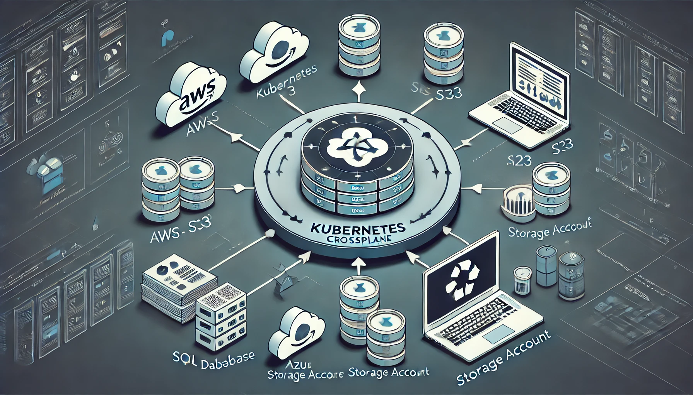
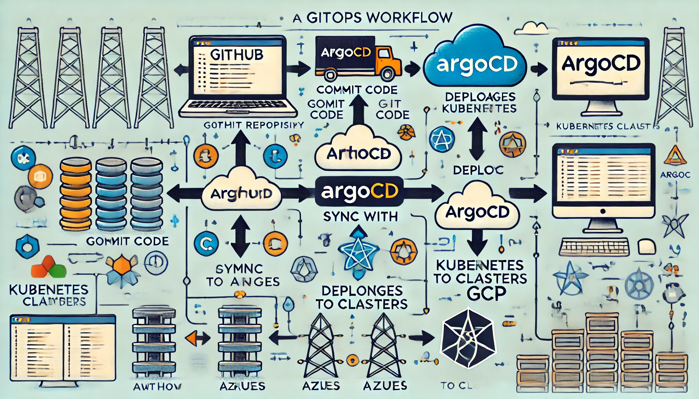
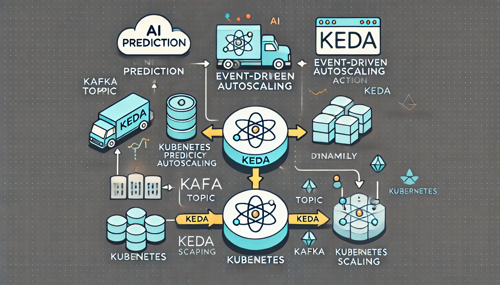
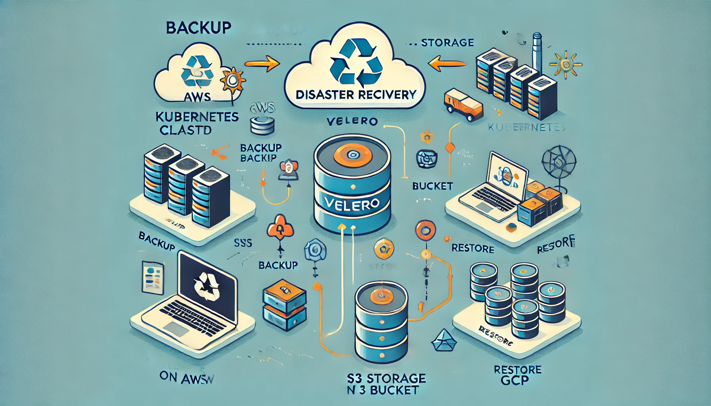

# 🚀 **Crossplane + ArgoCD + GitOps + KEDA: The Ultimate Kubernetes Toolkit**



Welcome to the **enterprise-grade Kubernetes repository**! This project showcases powerful tools and workflows for multi-cloud infrastructure, GitOps automation, predictive scaling, and disaster recovery.

---

## 📷 **Visual Highlights**

### **1. Crossplane in Action**


### **2. GitOps Flow with ArgoCD**


### **3. KEDA Predictive Scaling**


### **4. Velero Disaster Recovery**


---

## 📂 **Repository Structure**

```plaintext
Crossplane-ArgoCD-GitOps-KEDA/
├── argocd-gitops/
├── assets/
├── crossplane-infra/
├── disaster-recovery/
├── fruit-operator/
└── keda-predictive-scaling/

Star this repository if you find it useful! ⭐